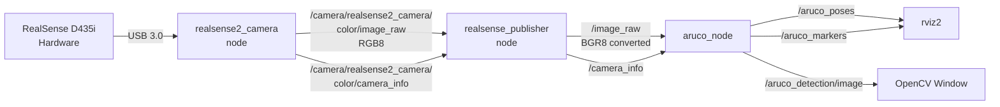

# ArUco Detection Guide

Welcome! This guide will help you get started with the ArUco marker detection. By the end, you'll understand how to set up, build, and run the detection system to track ArUco markers in real-time.

**Prerequisites:**
- ROS2 Jazzy installed on Ubuntu
- Basic terminal/command line familiarity
- Intel RealSense D435i camera (required)

--- 

## 1. Understanding ROS2 Workspaces

### What is a ROS2 Workspace?

Think of a ROS2 workspace like a **project folder for your robot code**. Just like you might organize a coding project with folders for source code, tests, and documentation, a ROS2 workspace organizes your robot software.

**The basic structure:**
```
your_workspace/
├── src/       # Your source code (this is where you work!)
├── build/     # Compiled code (auto-generated, don't edit)
├── install/   # Ready-to-run packages (auto-generated)
└── log/       # Build logs (auto-generated)
```

**Important concept: "Sourcing"**

Before you can use ROS2 or your workspace, you need to "source" it. Sourcing is like telling your terminal: *"Hey, here's where the ROS2 tools and my code live!"*

You'll do this a lot:
```bash
source /opt/ros/jazzy/setup.bash       # Load ROS2 tools
source install/setup.bash              # Load your workspace
```

### Workspace vs Package

- **Workspace** = A folder containing multiple packages (your whole robot project)
- **Package** = A single reusable component (like `aruco_detection` for marker tracking)

**Analogy:** If your robot is a car, the workspace is the garage, and each package is a specific part (engine, wheels, GPS).

For this project, you'll have **one workspace** with **two packages**:
- `aruco_detection` - Main detection logic
- `aruco_detection_interfaces` - Custom message types

---

## 2. Setting Up Your Development Environment

### Install Python Dependencies

This project needs specific versions of OpenCV and NumPy to work with ROS2 Jazzy.

**Why specific versions matter:**
- **OpenCV 4.8.x** - Has the `ArucoDetector` API we use
- **NumPy < 2.0** - Required for ROS2's `cv_bridge` (converts between ROS and OpenCV images)

**Installation:**
```bash
pip install opencv-contrib-python==4.8.1.78 numpy==1.26.4 pyrealsense2 --break-system-packages
```

**Note on Virtual Environments:**

For simplicity, we'll install packages system-wide. This is the most straightforward approach and avoids potential confusion with sourcing order and workspace setup.

### Clone the Repository

```bash
# Navigate to where you want your workspace
cd ~

# Clone the team repository
git clone https://github.com/rice-robotics-club/auto-nav-f2025.git

# Navigate to the workspace
cd auto-nav-f2025
```

### Install Intel RealSense Support (Required)

This project requires the Intel RealSense D435i camera. Follow these steps to install the necessary software:

**Step 1: Install Intel RealSense SDK**

Follow the official installation guide at: https://github.com/IntelRealSense/realsense-ros#installation-on-ubuntu

Specifically, follow **Step 2, Option 1 (Linux Debian Installation)** from the guide.

**Step 2: Install ROS2 RealSense Wrapper Packages**

Install each package individually:

```bash
sudo apt install ros-jazzy-realsense2-dbsym
sudo apt install ros-jazzy-realsense2-dbgsym
sudo apt install ros-jazzy-realsense2-description
sudo apt install ros-jazzy-realsense2-camera-dbgsym
sudo apt install ros-jazzy-realsense2-camera-msgs-dbgsym
sudo apt install ros-jazzy-realsense2-camera
sudo apt install ros-jazzy-realsense2-camera-msgs
```

**Step 3: Verify Installation**

Check that your RealSense camera is detected:

```bash
rs-enumerate-devices
```

You should see information about your connected D435i camera. If you get a "command not found" error, the SDK wasn't installed correctly. If no camera is detected, check your USB 3.0 connection.

---

## 3. Building the ROS2 Workspace

### Understanding the Project Structure

```
auto-nav-f2025/
└── aruco_detection/
    ├── aruco_detection/           # Main detection package
    │   ├── aruco_detection/       # Python source code
    │   ├── launch/                # Launch files
    │   ├── config/                # Configuration files
    │   └── setup.py               # Package metadata
    └── aruco_detection_interfaces/ # Custom message definitions
```

### Building Step-by-Step

Open a terminal and navigate to your workspace root:

**Step 1: Source ROS2**
```bash
source /opt/ros/jazzy/setup.bash
```
*What this does:* Loads all the ROS2 tools (like `colcon`, `ros2 launch`, etc.) into your current terminal session.

**Step 2: Build the packages**
```bash
colcon build
```
*What this does:*
- Compiles your code
- Generates message types
- Creates the `build/`, `install/`, and `log/` directories
- Prepares everything to run

This will take 30-60 seconds the first time.

**Step 3: Source your workspace**
```bash
source install/setup.bash
```
*What this does:* Tells ROS2 to use the packages you just built. You need to do this in every new terminal!

**💡 Pro Tip:** Add these to your `~/.bashrc` to auto-source on terminal startup:
```bash
echo "source /opt/ros/jazzy/setup.bash" >> ~/.bashrc
echo "source ~/auto-nav-f2025/install/setup.bash" >> ~/.bashrc
```

### Troubleshooting Build Issues

**"Package 'aruco_detection' not found"**
- Did you run `colcon build` from the workspace root?
- Did you source the workspace with `source install/setup.bash`?

**"No module named 'cv2'"**
- Install OpenCV with the pip command from Step 2

**Build errors or want a fresh start?**
```bash
# Clean everything and rebuild
rm -rf build install log
colcon build
```

**Rebuild just one package (faster):**
```bash
colcon build --packages-select aruco_detection
```

---

## 4. Running ArUco Detection

### Generate Test Markers (First Time Setup)

Before you can detect markers, you need some markers to detect! Let's generate one:

```bash
ros2 run aruco_detection aruco_generate_marker --id 1 --size 200 --dictionary DICT_4X4_50
```

This creates a file called `marker_0001.png` in your current directory.

**What to do with it:**
- **Option 1:** Print it on paper
- **Option 2:** Display it on your phone or a second monitor
- **Option 3:** Open it in an image viewer

Make sure it's at least 2-3 inches on screen/paper for best detection.

### Launch the Complete System

**With RealSense and RViz visualization (recommended for testing):**
```bash
source install/setup.bash  # If you haven't already in this terminal
ros2 launch aruco_detection aruco_detection.launch.py camera_type:=realsense stream_type:=color
```

**Without RViz (for headless robot deployment):**
```bash
ros2 launch aruco_detection aruco_detection.launch.py camera_type:=realsense stream_type:=color use_rviz:=false
```

**Available Launch Arguments:**

You can customize the launch with these arguments:

- `camera_type`: Camera source to use
  - `webcam` - Use laptop/USB webcam (default, for testing only)
    - calibration needs to be done for webcam, and currently `webcam_publisher.py` doesn't utilize calibrated data from `camera-calib.py` or the generated `camera_calibration.npz` file
  - `realsense` - Use Intel RealSense D435i (recommended, no extra calibration with `camera-calib.py` needed)

- `stream_type`: For RealSense, which stream to use
  - `color` - RGB color stream (default, recommended for ArUco detection)
  - `depth` - Depth stream (grayscale distance data)
  - `infra1` - Left infrared camera
  - `infra2` - Right infrared camera

- `use_rviz`: Show RViz 3D visualization
  - `true` - Show RViz (default)
  - `false` - No visualization (headless mode)

**Example with multiple arguments:**
```bash
# RealSense with depth stream and no RViz
ros2 launch aruco_detection aruco_detection.launch.py camera_type:=realsense stream_type:=depth use_rviz:=false
```

**Note:** Always use `stream_type:=color` for ArUco marker detection. The other streams are provided for other use cases (not currently used).

### What You Should See

When the system launches successfully, you'll see:

**1. OpenCV Window - "Detected Markers"**
- Live webcam feed
- When you hold up your marker:
  - Green outline around the detected marker
  - Red, green, and blue axes overlaid on the marker (showing its 3D orientation)

**2. RViz Window (if enabled)**
- A 3D view with a grid
- When you hold up your marker:
  - Small colored axes appear in the 3D space (red=X, green=Y, blue=Z)
  - These show where the marker is relative to the camera

**How to use RViz:**
- **Scroll wheel:** Zoom in/out
- **Middle-click + drag:** Pan around the scene
- **Left-click + drag:** Rotate your viewpoint

**3. Terminal Output**
You should see logs like:
```
[INFO] [aruco_node]: Marker size: 0.1
[INFO] [aruco_node]: Marker type: DICT_4X4_50
[INFO] [webcam_publisher]: Webcam publisher started
```

---

## 5. Understanding ROS2 Topics (The Communication System)

### What are Topics?

ROS2 uses **topics** for communication between different parts of your robot software. Think of topics like **radio stations**:
- Some nodes **broadcast** (publish) data on a topic
- Other nodes **tune in** (subscribe) to receive that data
- Many nodes can publish or subscribe to the same topic

### System Architecture

Here's how the different components connect in Intel RealSense mode:



**How it works:**

1. **RealSense camera** connects via USB 3.0 and is managed by the `realsense2_camera` driver node
2. **realsense2_camera node** publishes raw RGB images and factory calibration data
3. **realsense_publisher node** (our custom bridge):
   - Subscribes to RealSense topics
   - Converts RGB images to BGR format (required by OpenCV/ArUco)
   - Republishes to standardized topic names that `aruco_node` expects
4. **aruco_node** processes images and publishes marker detections
5. **RViz and OpenCV** display the results

This architecture allows us to use different cameras (webcam or RealSense) while keeping the ArUco detection code unchanged.

### Key Topics in This System

#### Camera Input Topics

These topics provide camera data to the system:

**RealSense Mode Topics:**

| Topic | Publisher | Type | Description |
|-------|-----------|------|-------------|
| `/camera/realsense2_camera/color/image_raw` | `realsense2_camera` | `sensor_msgs/Image` | Raw RGB8 images from RealSense camera |
| `/camera/realsense2_camera/color/camera_info` | `realsense2_camera` | `sensor_msgs/CameraInfo` | Factory calibration from RealSense |
| `/camera/realsense2_camera/depth/image_rect_raw` | `realsense2_camera` | `sensor_msgs/Image` | Depth data (distance measurements) |
| `/image_raw` | `realsense_publisher` | `sensor_msgs/Image` | RGB→BGR converted images for ArUco |
| `/camera_info` | `realsense_publisher` | `sensor_msgs/CameraInfo` | Remapped calibration data |

**Note:** The `realsense_publisher` node acts as a bridge, converting and remapping RealSense topics to the standardized `/image_raw` and `/camera_info` that `aruco_node` expects.

**Webcam Mode Topics:**

| Topic | Publisher | Type | Description |
|-------|-----------|------|-------------|
| `/image_raw` | `webcam_publisher` | `sensor_msgs/Image` | BGR8 images directly from webcam |
| `/camera_info` | `webcam_publisher` | `sensor_msgs/CameraInfo` | Approximate calibration (estimated) |

#### ArUco Detection Output Topics

These topics are published by `aruco_node` with marker detection results:

| Topic | Type | Description |
|-------|------|-------------|
| `/aruco_poses` | `geometry_msgs/PoseArray` | 3D positions and orientations for RViz visualization |
| `/aruco_markers` | `aruco_detection_interfaces/ArucoMarkers` | Marker IDs paired with their poses (most useful for robot control!) |
| `/aruco_detection/image` | `sensor_msgs/Image` | Camera feed with detected markers and 3D axes overlaid |

### Useful Debug Commands

While the system is running, open a new terminal and try these:

```bash
# Don't forget to source first!
source /opt/ros/jazzy/setup.bash
source install/setup.bash

# See all active topics
ros2 topic list

# View real-time marker detections (hold marker to camera)
ros2 topic echo /aruco_markers

# Check how fast topics are publishing (should be ~30 Hz)
ros2 topic hz /aruco_poses

# Get detailed info about a topic
ros2 topic info /aruco_markers

# See what nodes are currently running
ros2 node list

# Get info about the aruco_node
ros2 node info /aruco_node

# RealSense-specific commands:
# See all RealSense camera topics
ros2 topic list | grep realsense2_camera

# Check RealSense camera node details
ros2 node info /camera/realsense2_camera

# Inspect the realsense_publisher bridge node
ros2 node info /realsense_publisher

# Verify image is flowing from RealSense
ros2 topic hz /camera/realsense2_camera/color/image_raw

# Verify converted image is flowing to aruco_node
ros2 topic hz /image_raw
```

---

## 6. Quick Reference & Troubleshooting

### Daily Workflow

Every time you want to run the system:

```bash
# 1. Open terminal, navigate to workspace
cd ~/auto-nav-f2025

# 2. Source ROS2 and workspace (REQUIRED in every new terminal!)
source /opt/ros/jazzy/setup.bash
source install/setup.bash

# 3. Launch the system
ros2 launch aruco_detection aruco_detection.launch.py camera_type:=realsense stream_type:=color
```

### Common Issues & Solutions

| Problem | Solution |
|---------|----------|
| **"Package 'aruco_detection' not found"** | Did you source the workspace? Run `source install/setup.bash` |
| **"No module named 'cv2'"** | Install OpenCV: `pip install opencv-contrib-python==4.8.1.78 --break-system-packages` |
| **"No module named 'numpy'"** | Install NumPy: `pip install numpy==1.26.4 --break-system-packages` |
| **Markers not detected** | • Ensure good lighting<br>• Hold marker steady<br>• Make sure marker is large enough (2-3 inches)<br>• Check marker dictionary matches (DICT_4X4_50) |
| **RViz shows gray screen** | • Check topics are publishing: `ros2 topic list`<br>• Verify Fixed Frame is set to `map` in RViz |
| **OpenCV window doesn't show** | Normal on headless systems, use RViz instead |
| **Build errors after pulling new code** | Clean rebuild: `rm -rf build install log && colcon build` |
| **RealSense camera not detected** | • Check USB 3.0 connection (blue USB port)<br>• Verify installation: `rs-enumerate-devices`<br>• Try different USB port<br>• Ensure RealSense SDK installed correctly |
| **No camera topics publishing** | • Verify ROS packages: `dpkg -l \| grep realsense2-camera`<br>• Check nodes running: `ros2 node list`<br>• Review launch terminal for errors |

### Keyboard Shortcuts

- **Ctrl+C** - Stop the running system (in the terminal where you launched)
- **Q** - Close OpenCV window (when focused on it)

---

### Learn More
- **ROS2 Tutorials:** [ROS2 Official Tutorials](https://docs.ros.org/en/jazzy/Tutorials.html)
- **Modify Parameters:** Check `aruco_detection/config/aruco_parameters.yaml` to change marker size, camera frame, etc.
- **Custom Markers:** Generate different markers with `--id`, `--size`, and `--dictionary` options
